# vessels
Retinal blood vessel segmentation using convolutional neural network (u-net) and image processing techniques.

### Prerequisites
Use conda's spec file in order to create identical environment on your local machine:

```
cd vessels
conda create --name myenv --file dependencies.yml
conda activate myenv
```
Then run:
```
jupyter notebook
```

### Simple classification using image processing techniques
1. Original image:

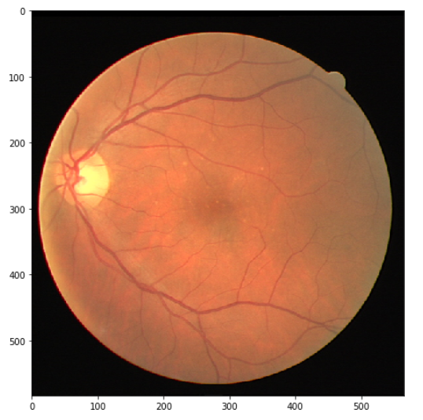

2. Transformation to grayscale:

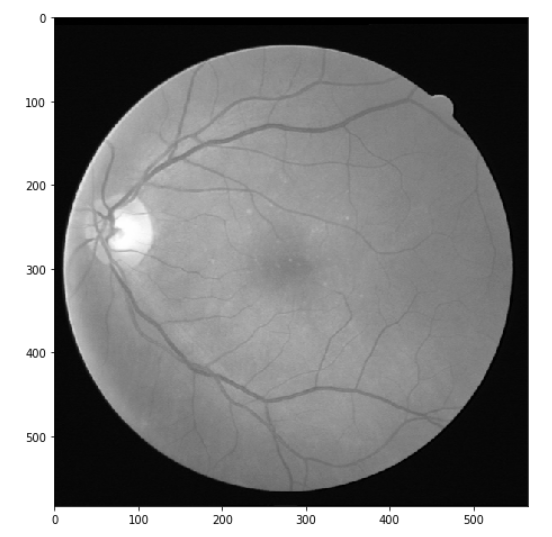

3. CLAHE (Constrast-limited adaptive histogram equalization):

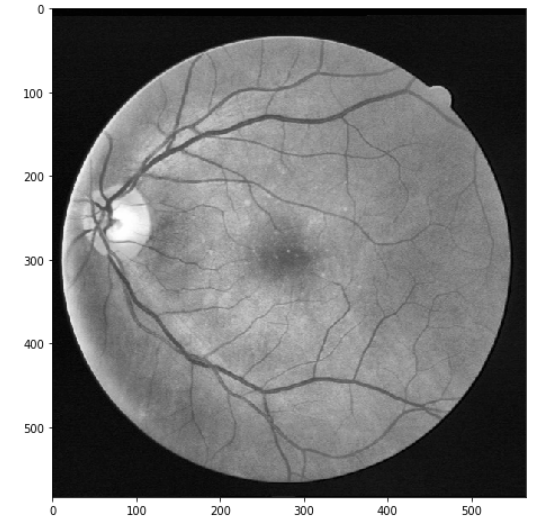

4. Gamma correction:

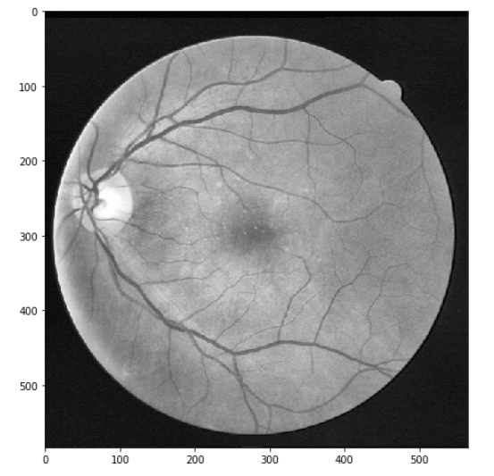

5. cv2.fastNlMeansDenoising:

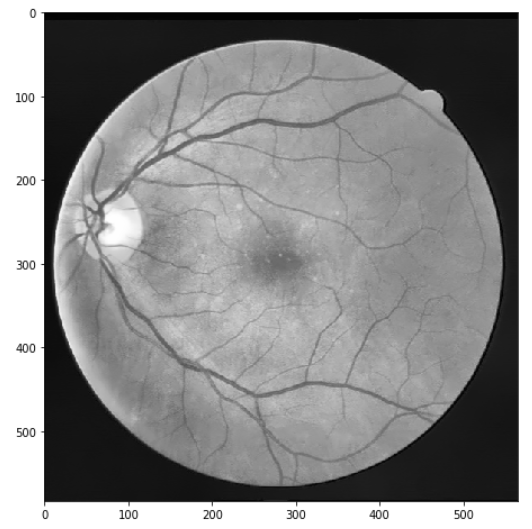

6. Ridge detection:

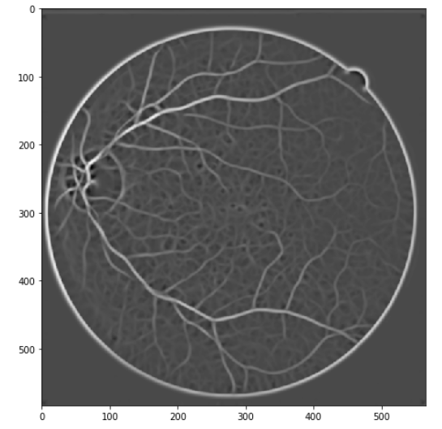

7. Mask:

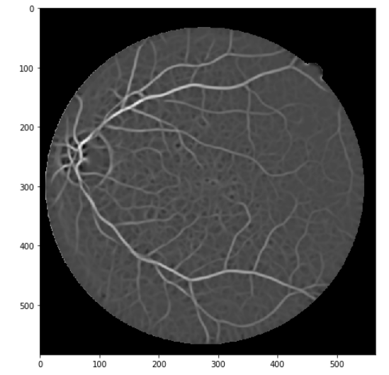

8. Median filter: 

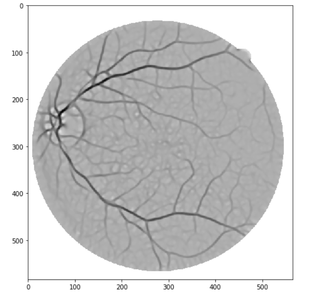

9. Threshold: 

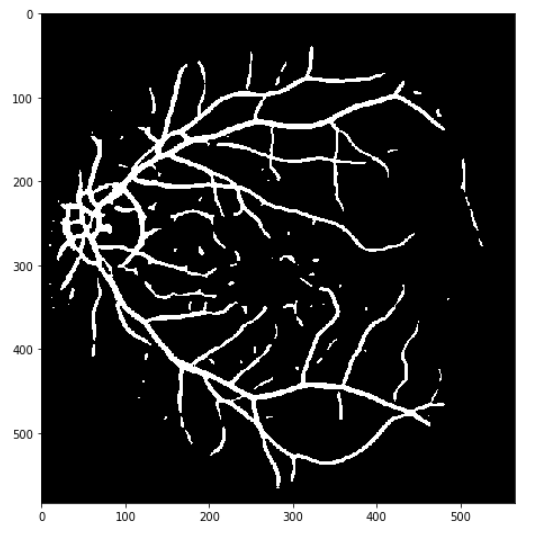

10. Results:


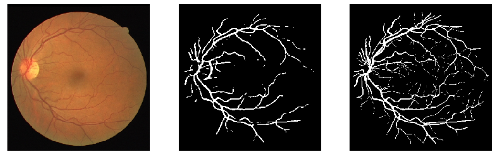

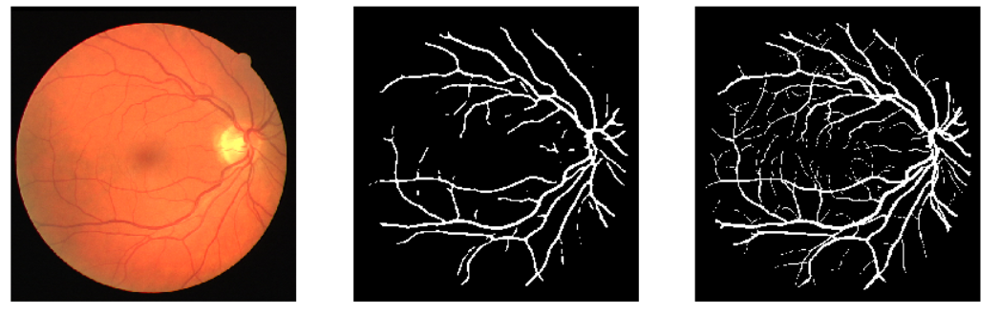

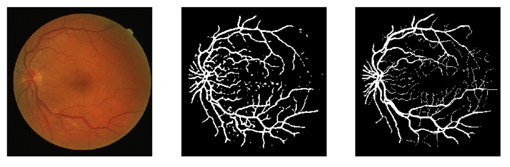

Simple classificator evaluation:

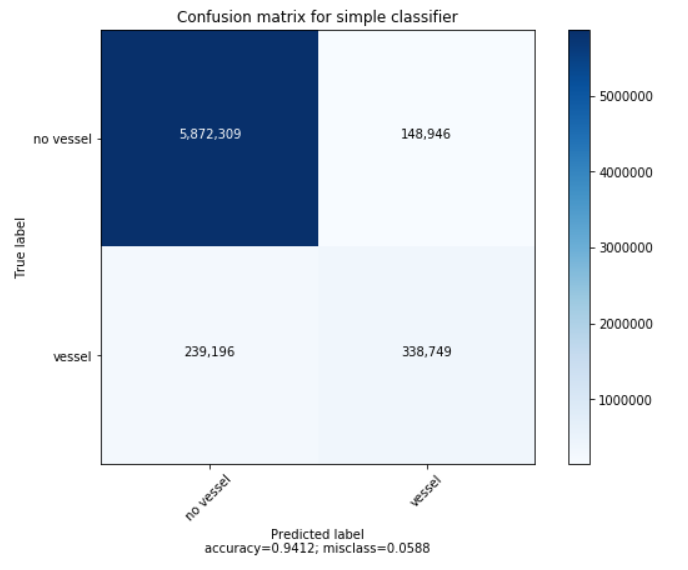

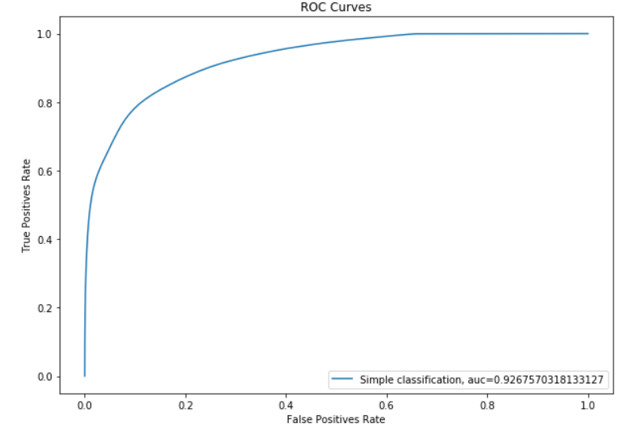

### Classification using U-Net architecture
[U-Net](https://en.wikipedia.org/wiki/U-Net) architecture is widely used in medical field when it comes to image segmentation. We train the network with small and random image crops sized 64 x 64 pixels, and for each of them we get 1 if it's classified as a blood vessel or 0 if's not. The training took 100 epochs, 125 steps each with the batch size equal to 16 random image crops. We used Google Colab in order to train our model (Nvidia Tesla K80). The training took no longer than 40 minutes. Some of the results are presented below:

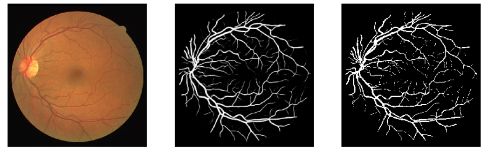

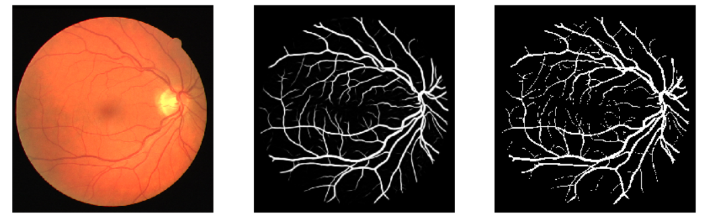

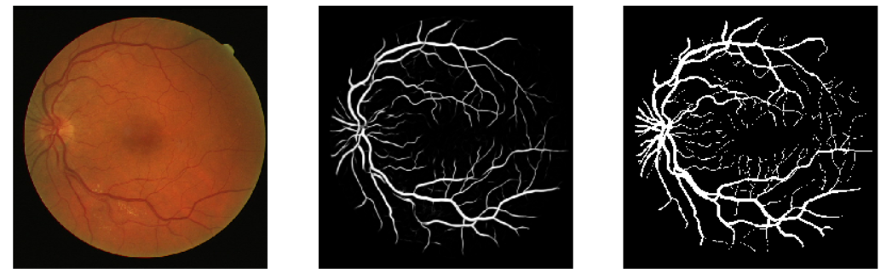

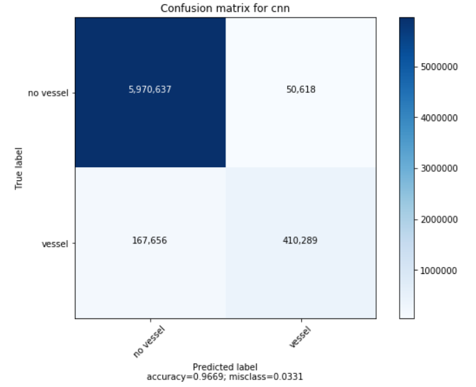

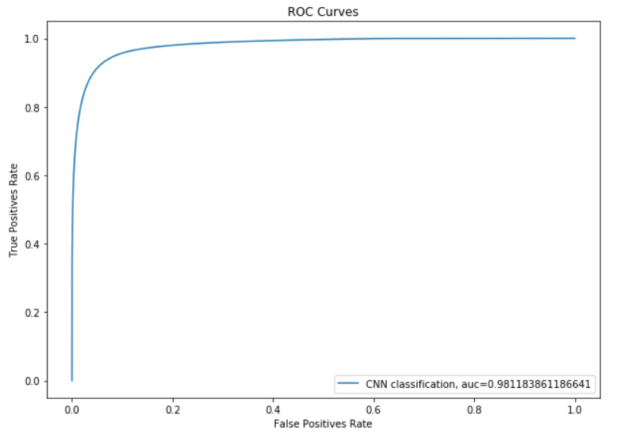
